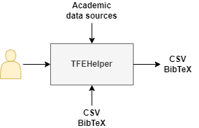
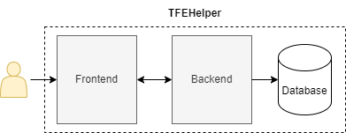

# TFEHelper

TFE stands for "**T**rabajo **F**inal de **E**specialización" (final project for post-degree specialization) and TFEHelper is a single user tool designed for helping students on the collection and curate of diverse academic articles from the internet, when a [Systematic Literature Review (SLR)](https://en.wikipedia.org/wiki/Systematic_review) is needed.

With TFEHelper, users can:
- Import, normalize, convert and export data sources to and from [CSV](https://en.wikipedia.org/wiki/Comma-separated_values) or [BibTeX](https://en.wikipedia.org/wiki/BibTeX) files.
- Connect to several academic data sources for articles collection.
- Keep information centralized in order to ease their classification work.

  

Currently, TFEHelper access to [Springer Link database](https://link.springer.com/) and [Scopus](https://www.scopus.com) through their public API for meta-data collection and it's planned to also enable access to:
- IEEE Xplore
- Pubmed
- Eric
- Doaj
- arXiv

## Details

TFEHelper is formed based on backend-frontend software architecture as follows:

  

The frontend is a Web based GUI which access to the Backend via REST messages.  Backend is 100% decoupled from the solution and can be used as stand-alone or be connected to another frontend you like.

For further technical details, please follow the below links.

### TFEHelper.Backend

[Readme](src/Backend/README.md)

### TFEHelper.Frontend

[Readme](src/Frontend/README.md)

## Usage
Follow the next steps for install and running TFEHelper:
1. Clone the repository
2. Run `docker compose up -d`
3. Access the GUI via `http://localhost:80`

You can inspect the REST API via `http://localhost:5000/swagger`
  
>Note: Frontend and Backend ports can be changed by editing `compose.yaml`.
