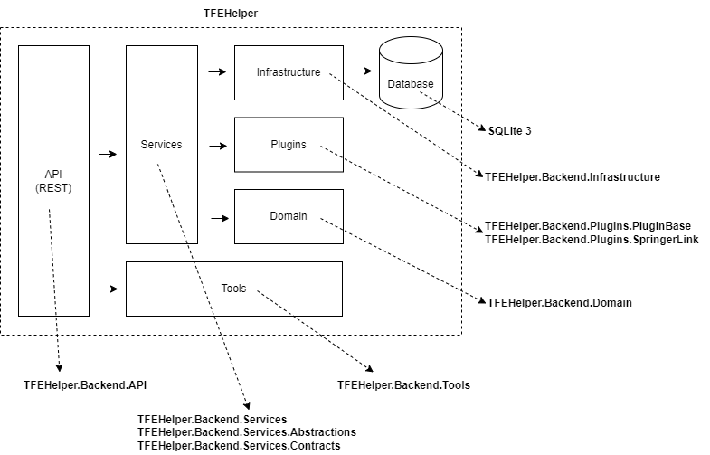

# TFEHelper.Backend

TFEHelper.Backend architecture design is based on [Clean architecture](https://blog.cleancoder.com/uncle-bob/2012/08/13/the-clean-architecture.html) proposed by Robert C. Martin in 2012 which is also based on [Onion architecture](https://jeffreypalermo.com/2008/07/the-onion-architecture-part-1/) originally proposed by Jeffrey Palermo in 2008 and [Hexagonal architecture](https://en.wikipedia.org/wiki/Hexagonal_architecture_(software)) by Alistair Cockburn, among others.
  
Following is the layer structure defined for TFEHelper.Backend:

  

And also the blocks structure:

  

