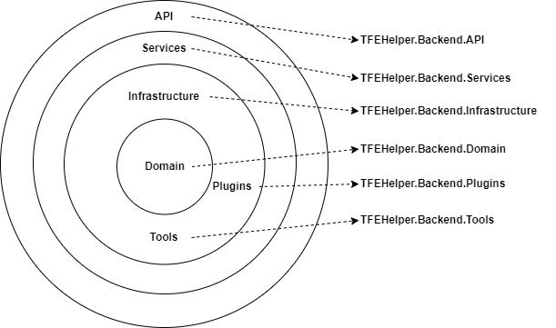
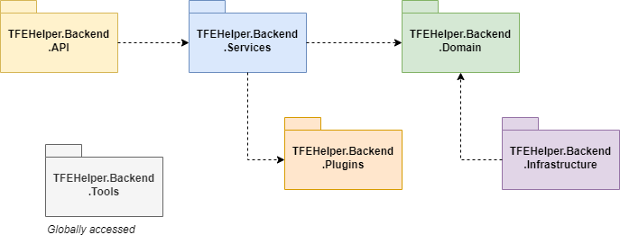
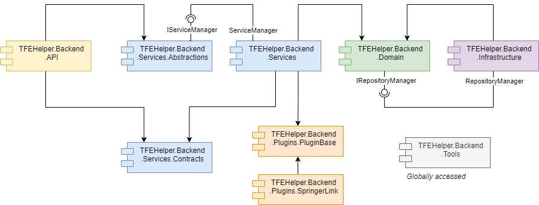

# TFEHelper.Backend

## Architecture and Design

TFEHelper.Backend architecture design is based on [Clean architecture](https://blog.cleancoder.com/uncle-bob/2012/08/13/the-clean-architecture.html) proposed by Robert C. Martin in 2012 which is also based on [Onion architecture](https://jeffreypalermo.com/2008/07/the-onion-architecture-part-1/) originally proposed by Jeffrey Palermo in 2008 and [Hexagonal architecture](https://en.wikipedia.org/wiki/Hexagonal_architecture_(software)) by Alistair Cockburn, among others.
<br></br>
Following is the layer structure defined for TFEHelper.Backend:
<p align="center">
  
</p>
<br></br>
The blocks structure:
<p align="center">
  
</p>
<br></br>
The overal packages diagram:
<br></br>
<p align="center">
  
</p>
<br></br>
And their deglosed components:
<br></br>
<p align="center">
  
</p>

## Plugins architecture

TFEHelper.Backend provides out of-the-box the capacity of being expanded by the usage of its plugin architecture.

In order to create a plugin for TFEHelper.Backend, a .NET library project containing at least one implementation of the interface `IBasePlugin` hirearchy must be created.  The project must include the `TFEHelper.Backend.Plugins.PluginBase` library on its references.  The resulting library must be placed in the same folder where TFEHelper.Backend resides.

### The "PublicationsCollector" plugin type

This plugin type (which implements `IPublicationsCollector` interface) expands the capacity of TFEHelper.Backend by allowing developers to add new data sources for collecting academic articles.<br>
Any plugin added to the TFEHelper.Backend.Plugins ecosystem is automatically enabled via TFEHelper.Backend.API to be executed by just identify its id by:

1. Get plugin information from TFEHelper.Backend.API `/api/Plugins` endpoint.<br>
This will return a data structure as follows:

```json

{
  "statusCode": 200,
  "isSuccessful": true,
  "errorMessages": [],
  "payload": [
    {
      "id": 1,
      "type": 0,
      "name": "Dummy plugin",
      "version": "1.0.0",
      "description": "Test plugin for IPublicationsCollector"
    }
  ]
}

```
>Note that `"type": 0` corresponds to `SearchSourcePLGType.Manual` enum value.  There are several options to choose according the use case.
   
2. Run TFEHelper.Backend.API `/api/Plugins/Collectors/{id}/Run` endpoint where {id} is the identity retrieved from previous step and populate the following strcture which will be internally mapped to `PublicationsCollectorParametersPLG`:<br>

```json

{
  "query": "example AND text",
  "searchIn": "",
  "subject": "",
  "dateFrom": "2024-01-10",
  "dateTo": "2024-02-17",
  "returnQuantityLimit": 10
}

```
where:
- query: the filter to be implemented in the plugin.
- searchIn / subject: in case the data source need a special sub-filter.
- dateFrom / dateTo: the date filters.
- returnQuantityLimit: how many records will the plugin return.

After running the enpoint, the backend will asynchronously run the plugin's `IPublicationsCollector.GetPublicationsAsync` implementation and the following structure will be returned:

```json

{
  "statusCode": 200,
  "isSuccessful": true,
  "errorMessages": [],
  "payload": [
    {
      "id": 0,
      "Abstract": "this is an example of abstract text...",
      "Authors": "the name of the authors...",
      "DOI": "DOI value",
      "ISBN": "ISBN value",
      "ISSN": "ISSN value",
      "Key": "Key value",
      "Keywords": "Keywords value",
      "Pages": "Pages value",
      "Source": 5,
      "Title": "Title value",
      "Type": 0,
      "URL": "URL value",
      "Year": 1995
    }
  ]
}

```

Following is a complete example (extracted from `TFEHelper.Backend.Plugins.DummyPlugin`) on how to implement the PublicationsCollector type plugin:

```c#

using Microsoft.Extensions.Logging;
using System;
using System.Collections.Generic;
using System.Threading;
using System.Threading.Tasks;
using TFEHelper.Backend.Plugins.PluginBase.Common.Enums;
using TFEHelper.Backend.Plugins.PluginBase.Interfaces;
using TFEHelper.Backend.Plugins.PluginBase.Specifications.PublicationsCollector.Classes;
using TFEHelper.Backend.Plugins.PluginBase.Specifications.PublicationsCollector.Enums;
using TFEHelper.Backend.Plugins.PluginBase.Tools;

namespace TFEHelper.Backend.Plugins.Dummy
{
    public class DummyPlugin : IPublicationsCollector
    {
        public string Name => "Dummy plugin"; 
        public Version Version => new Version(1,0,0);
        public PluginType Type => PluginType.PublicationsCollector;
        public string Description => "Test plugin for IPublicationsCollector";

        private ILogger _logger;
        private PluginConfigurationController _config;

        public bool Configure(ILogger logger)
        {
            _logger = logger;
            _config = new PluginConfigurationController(_logger, "my_config_file.cfg");

            return true;
        }

        public Task<IEnumerable<PublicationPLG>> GetPublicationsAsync(PublicationsCollectorParametersPLG searchParameters, CancellationToken cancellationToken = default)
        {

            _logger.LogInformation("Getting publications...");
            string dummyValue = _config.Get<string>("DummyValue");

            var result = new List<PublicationPLG>()
            {
                new PublicationPLG()
                {
                    Abstract = "this is an example of abstract text...",
                    Authors = "the name of the authors...",
                    DOI = "DOI value",
                    ISBN = "ISBN value",
                    ISSN = "ISSN value",
                    Key = "Key value",
                    Keywords = "Keywords value",
                    Pages = "Pages value",
                    Source = SearchSourcePLGType.Manual,
                    Title = "Title value",
                    Type = BibTeXPublicationPLGType.Article,
                    URL = "URL value",
                    Year = 1995
                }
            };

            return Task.Run<IEnumerable<PublicationPLG>>(() => { return result; }, cancellationToken);
        }

        public bool IsOnline()
        {
            return true;
        }
    }
}

```
This example returns one `PublicationPLG` hardcoded instance to TFEHelper.Backend.

In case the plugin needs to load some configuration on runtime, TFEHelper.Backend.Plugins.PluginBase library offers to dinamically load `PluginConfigurationItem` instances by using `PluginConfigurationController` as shown in the previous example.  In order to achieve this, an ASCII configuration file containing the following Json specification must be provided:

```json

[
  {
    "Name": "My config parameter name",
    "Value": "My config parameter value"
  }	
]

```
>Note that if no configuration file is provided, `PluginConfigurationController` will try to search a file with the same name as the library binary file with ".cfg" extension.

<br></br>
Currently only `PluginType.PublicationsCollector` is supported.  In the future more plugin types will be incorporated.

Any 3rd party contribution is always welcomed.
